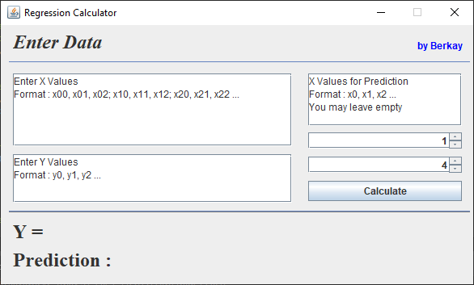
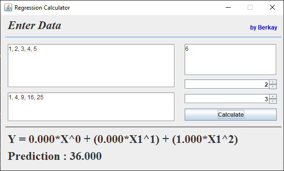

# Java Regression Calculator

## Overview
Java Regression Calculator is a linear regression calculator that uses the normal equation. It also has a feature to include power terms.

## Screenshots

_Default Interface_

_Example Usage_

## Classes
- **Main** : The main class of the Java Regression Calculator that features a user interface implementation.
- **Regression** : This class utilizes the normal equation *(XT X)-1 XT y* to calculate a linear regression.
- **Matrix** : Matrix class has implementations for the matrix operations to be used in the regression calculation.

## Planned Changes
In the future updates, a class to import csv files to simplify the usage of the program will be added. Additionally, some features to customize the models further are planned to added.

